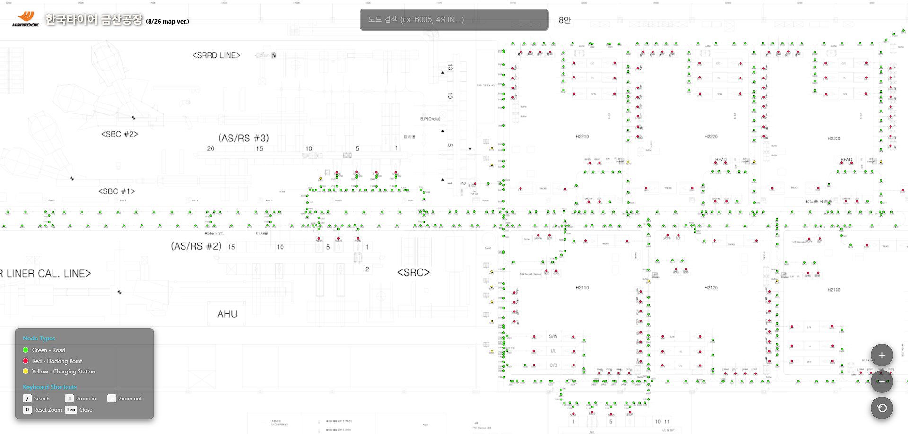

# Hanta Map

An interactive factory floor map for Hankook Tire's Geumsan Factory. This web application provides real-time visualization and navigation of RFID nodes, docking points, and charging stations throughout the factory.

## 🏭 Overview

Hanta Map is a specialized navigation tool designed for the Hankook Tire Geumsan Factory (한국타이어 금산공장). It displays an interactive map with over 950+ RFID nodes, enabling efficient navigation and location tracking within the factory environment.

## ✨ Features

- **Interactive Map Navigation**: Pan, zoom, and navigate throughout the factory floor plan
- **RFID Node Search**: Search for specific nodes by ID or description (e.g., "6005", "4S IN")
- **Node Classification**: 
  - 🟢 Green - Road/Path nodes
  - 🔴 Red - Docking points
  - 🟡 Yellow - Charging stations
- **Real-time Highlighting**: Visual beacon effects for selected nodes
- **Keyboard Shortcuts**: Quick navigation with keyboard controls
- **Responsive Design**: Works on desktop and mobile devices

## 🚀 Demo



Visit the live application: [Hanta Map](https://hanta.vercel.app)

## 🛠️ Technology Stack

- **Frontend**: JavaScript, HTML5 Canvas, CSS3
- **Deployment**: Vercel
- **Data**: JSON-based node configuration
- **Graphics**: Canvas-based rendering for optimal performance

## 📋 Usage

### Navigation Controls
- **Mouse**: Click and drag to pan, scroll wheel to zoom
- **Touch**: Pinch to zoom, drag to pan (mobile)
- **Keyboard Shortcuts**:
  - `/` - Focus search
  - `+` - Zoom in
  - `-` - Zoom out
  - `0` - Reset view
  - `Esc` - Close popups

### Search Functionality
1. Use the search bar to find nodes by:
   - RFID ID numbers (e.g., "5183", "4037")
   - Descriptions (e.g., "4S IN", "6S OUT")
2. Click on search results to navigate to specific nodes
3. Selected nodes display detailed information in popups

## 🏗️ Project Structure

```
hantamap/
├── interactive-factory-map/     # Main application
│   ├── index.html              # Main HTML file
│   ├── script.js               # Core JavaScript functionality
│   ├── style.css               # Styling and theme
│   ├── nodes.json              # RFID node data (950+ nodes)
│   ├── factory-map.png         # Factory floor plan image
│   ├── hankook.webp           # hankook logo
│   └── vercel.json            # Deployment configuration
├── map-alignment-tool/          # Development utility
└── allnodes.json               # Complete node dataset
```

## 🚀 Local Development

1. **Clone the repository**:
   ```bash
   git clone <repository-url>
   cd hantamap
   ```

2. **Navigate to the application directory**:
   ```bash
   cd interactive-factory-map
   ```

3. **Serve the application**:
   ```bash
   # Using Python
   python -m http.server 8000
   
   # Using Node.js
   npx http-server
   
   # Using PHP
   php -S localhost:8000
   ```

4. **Open in browser**:
   ```
   http://localhost:8000
   ```

## 📊 Node Data Format

The application uses a JSON structure for node data:

```json
{
  "id": "node_1",
  "name": "RFID 5183",
  "x": 6368,
  "y": 5019,
  "description": "4S IN"
}
```

- `id`: Unique node identifier
- `name`: RFID tag identifier
- `x`, `y`: Pixel coordinates on the factory map image
- `description`: Optional descriptive text

## 🎯 Performance Features

- **Canvas Rendering**: Hardware-accelerated graphics for smooth interaction
- **Efficient Search**: Optimized search algorithms for large datasets
- **Lazy Loading**: Progressive loading of map assets
- **Memory Management**: Efficient handling of 950+ nodes

## 🔧 Configuration

The application can be customized through:
- `nodes.json`: Update node positions and descriptions
- `style.css`: Modify theme colors and UI elements
- `script.js`: Adjust zoom levels, animation speeds, and search behavior


